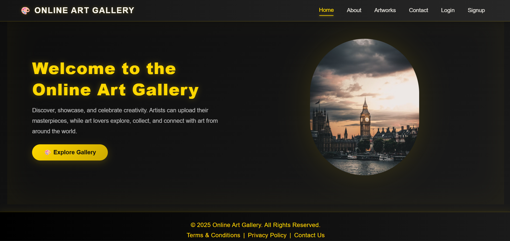
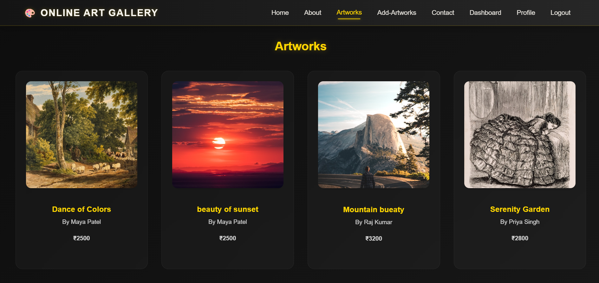

<p align="center">
  
</p>

<h1 align="center">🎨 Online Art Gallery</h1>
<p align="center">A modern full-stack art gallery platform built by <b>Shaik Sadik</b></p>

---

<p align="center">
  
  
  
  
  
</p>

---

A complete **Online Art Gallery Platform** built using modern full-stack technologies.  
Users can explore artworks, view details, and purchase them securely through **Razorpay**.  
The platform includes protected routes and authentication using **JWT**, with deployment across **Vercel**, **Render**, and **Railway**.

---

## 🌐 Live Demo

- **Frontend (Vercel):**  
  👉 https://onlineartgallery.slayercore.me/

- **Backend (Render API):**  
  👉 https://onlineartgallery-project.onrender.com

---

## 🧰 Tech Stack

| Layer | Technology |
|-------|------------|
| **Frontend** | React (Vite), Axios, React Router, Toastify |
| **Backend** | Spring Boot (REST API), JWT Security |
| **Database** | MySQL (Hosted on Railway) |
| **Payment Gateway** | Razorpay |
| **Deployment** | Frontend → Vercel<br>Backend → Render<br>Database → Railway |

---

## ✨ Features

- 👤 **User Signup/Login with JWT Authentication**  
- 🖼 **Browse Artworks**  
- 🔒 **Protected Routes** (User must login to View / Buy Artwork)  
- 🛒 **Buy Now with Razorpay Payment Gateway**  
- 👨‍💼 **Admin Panel – Add, Edit, Delete Artworks**  
- 📱 **Fully Responsive UI**

---

## 🖼️ Screenshots

> 
>
> 


---

## ⚡ Quick Start (Local Setup)

Follow these steps to run the project locally 👇

---

### 1️⃣ Clone the Repository

```bash
git clone https://github.com/sadikshaik01/OnlineArtGallery-Project.git
cd OnlineArtGallery-Project

OnlineArtGallery-Project/
│
├── OnlineArtGallery-Frontend/                   # React Frontend
│   ├── public/
│   ├── src/
│   ├── package.json
│   └── vite.config.js
│
├── OnlineArtGallery-Backend/                    # Spring Boot Backend
│   ├── src/main/java/
│   ├── src/main/resources/
│   ├── pom.xml
│   └── Dockerfile (if deployed with Docker)
│
└── README.md

