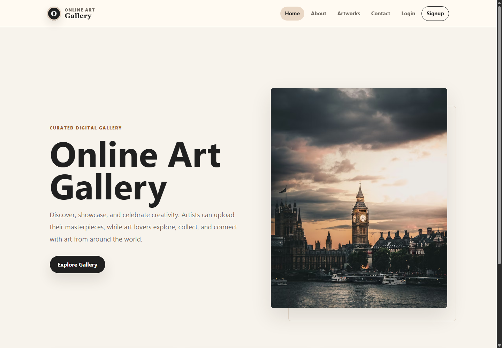
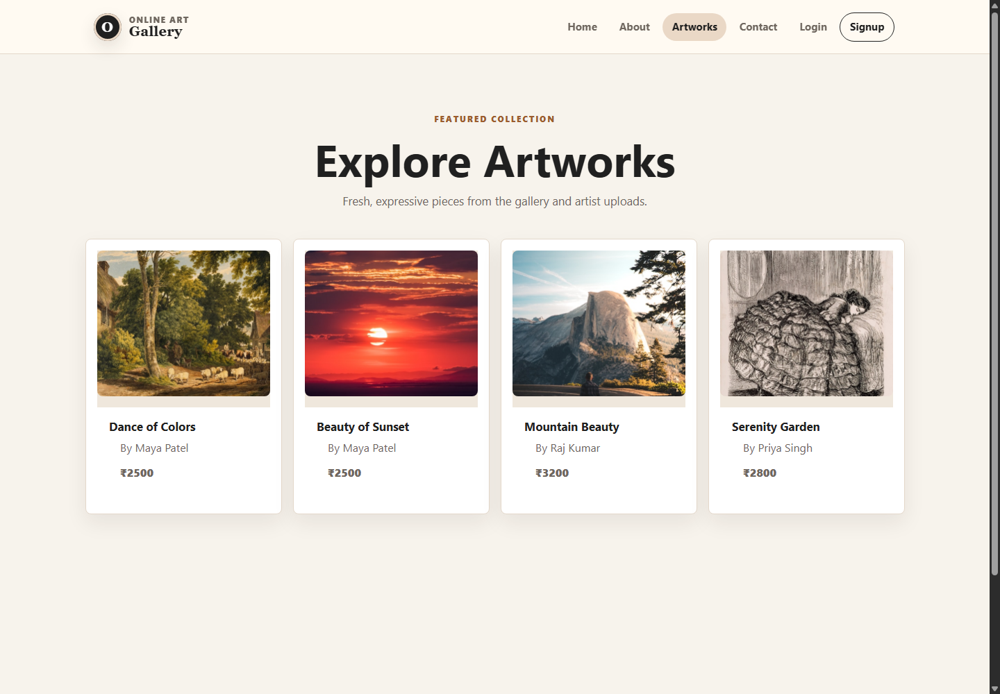

<div align="center">

# Online Art Gallery

### A clean full-stack art gallery platform for discovering, showcasing, and purchasing artwork.


</div>

---

## Overview

Online Art Gallery is a full-stack web application where visitors can explore curated artworks, view details, and purchase pieces through the existing Razorpay payment flow. Artists can manage artwork uploads through protected dashboard pages, while authentication and role-based access are handled by the backend.

The frontend has been refreshed with a softer gallery-inspired design: warm neutral backgrounds, clean cards, polished forms, a refined navbar brand, and responsive layouts that feel calmer and more modern.

---

## Live Project

- Frontend: https://onlineartgallery.slayercore.me/
- Backend API: https://onlineartgallery-project.onrender.com

---

## Preview

### Home Page



### Artworks Page



---

## Features

- User signup and login with JWT authentication
- Protected customer and artist routes
- Browse featured and uploaded artworks
- View artwork details after login
- Buy artwork through Razorpay integration
- Artist dashboard for adding and managing artwork
- Customer dashboard and profile pages
- Responsive frontend design for desktop and mobile

---

## Tech Stack

| Layer | Technology |
| --- | --- |
| Frontend | React, Vite, React Router, Bootstrap |
| Backend | Spring Boot, Spring Security, JWT |
| Database | PostgreSQL hosted on Supabase |
| Payments | Razorpay |
| Deployment | Vercel frontend, Render backend |

---

## Project Structure

```text
OnlineArtGallery-Project/
|-- OnlineArtGallery-Frontend/
|   |-- public/
|   |   |-- home-preview.png
|   |   |-- artworks-preview.png
|   |-- src/
|   |   |-- components/
|   |   |-- contexts/
|   |   |-- pages/
|   |   |-- styles/
|   |   |-- utils/
|   |-- package.json
|   |-- vite.config.js
|
|-- OnlineArtGallery-Backend/
|   |-- src/main/java/
|   |-- src/main/resources/
|   |-- pom.xml
|   |-- Dockerfile
|
|-- README.md
```

---

## Local Setup

### Frontend

```bash
cd OnlineArtGallery-Frontend
npm install
npm run dev
```

The frontend runs locally at:

```text
http://127.0.0.1:5173/
```

### Backend

```bash
cd OnlineArtGallery-Backend
./mvnw spring-boot:run
```

On Windows PowerShell:

```powershell
cd OnlineArtGallery-Backend
.\mvnw.cmd spring-boot:run
```

---

## Frontend Design Update

The latest frontend refresh keeps the existing backend/API connections unchanged and focuses only on presentation:

- Light warm gallery theme instead of the older heavy dark/gold style
- Redesigned navbar logo and navigation states
- Cleaner artwork cards and artwork detail modal
- Improved form styling across login, signup, contact, profile, and artwork upload pages
- Updated dashboard/card styling for a more consistent visual system
- Fresh screenshots saved in `OnlineArtGallery-Frontend/public/`

---

## Build

```bash
cd OnlineArtGallery-Frontend
npm run build
```

The current frontend build completes successfully.

---

## Author

Built by **Shaik Sadik**.
